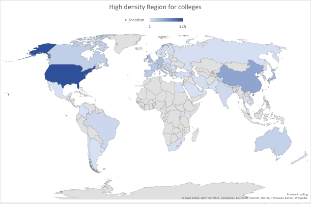

# Checkpoint3

* Datasets: World college ranking
* These colleges are ranked by location, national rank, quality of education, alumni employee, quality of faculty, publications, influences, citations, board impact, and patents, then it calculate a final score for ranking. 


* National Rank: basically order the final score for each colleges
* Quality of Education: it was calcualted from students' overall GPA from classes
* Alumni Employee: It focues on amount student who graduated from their old school and keep working there
* Quality of faculty: Based on teacher evaluation from students
* Publication: based on the sales volume from school's publication (book or research)
* influences: basically calcualte the amount of honorees and Distinguished Alumni
* Citation: It is just amount of citation
* Board Impact: influence created by the board of directors
* Patent: The number of patent they created 


Business Question: From this dataset, we can answer what colleges is the best in UK or some other countries, we can also find out the colleges have score below maybe 60 or 70. We are able to rank influences from highest to lowest. 

1. -- Rank the quality_of_education from the lowest to highest in the US

For Q1, we are ranking the world rank (USA) by quality of education from lowest to highest. After coding, we have our top 10 school colleges presented in the graph, they 

```SQL
SELECT world_rank,quality_of_education
FROM datasets.world_college_ranking
WHERE location = 'USA'
ORDER BY quality_of_education ASC
```


2. -- Rank the world rank from the highest to lowest in UK

```SQL
SELECT world_rank, institution
FROM datasets.world_college_ranking
WHERE location = 'United Kingdom'
ORDER BY world_rank ASC
```


3. -- Rank the publications based on the score between 92.8 to 100

```SQL
SELECT publications,
count(score) as n_score
FROM datasets.world_college_ranking
WHERE score between '80' and '100'
GROUP BY publications
ORDER BY n_score DESC
```


4. -- What schools have citation between 100 to 300

```SQL
SELECT institution, world_rank,
    count(citations) as w_cit
FROM datasets.world_college_ranking
WHERE citations between '100' and '300'
GROUP BY institution, world_rank
ORDER BY institution DESC
```


5.-- In the US, what schools have alumi-employment between 270 to 600

```SQL
SELECT institution, location, alumni_employment
FROM datasets.world_college_ranking
Where location = 'USA' AND alumni_employment between '270' AND '600'
GROUP BY institution, location,alumni_employment
ORDER BY alumni_employment DESC
```


6. -- What schools have score below 60?

```SQL
SELECT institution, score
FROM datasets.world_college_ranking
WHERE score <= '60'
ORDER BY score DESC
```




7. -- What schools have broad_impact below 300?

```SQL
SELECT institution, broad_impact
FROM datasets.world_college_ranking
WHERE broad_impact <= '300'
ORDER BY broad_impact DESC
```


8. -- What is the total organized quality_of_faculty in South Korea

```SQL
SELECT institution, broad_impact, location
FROM datasets.world_college_ranking
WHERE location = 'South Korea'
ORDER BY quality_of_faculty
```


9. -- What is the influence rank for Japan

```SQL
SELECT institution, location, influence
FROM datasets.world_college_ranking
WHERE location = 'Japan' 
ORDER BY influence DESC
```


10. -- what colleges have national rank between 15 to 270 and quality of education between 150 to 400

```SQL
SELECT institution, national_rank, quality_of_education
FROM datasets.world_college_ranking
WHERE national_rank between '15' and '270' AND quality_of_education between '150' and '400'
ORDER BY national_rank, quality_of_education DESC
```


